# Report of the Project

In this file we will describe all the steps we have followed to obtain the solution starting from the baseline.

### Dataset

Starting from the baseline architecture, we opted to train and validate the model using the data from just the S1 folder, which contains the data obtained from the movements of person 1 always in the same room divided in 3 days, we used the first 2 to train and the last one to validate / test.

- in this way we just train using always the same room / person so the generalization to other rooms / person can be done by exploiting other of them as the test set

The data for a given folder are divided other than for the day (which is represented by the letter a, b or c) also by:

- The type of movement registered, which can be either jump, walk, stay still, sit, run, ...
- the channel that has been used for that track, indeed we have 4 channels for each registration, in this way we are less dependent by the position of the router in the room

The data registered for each folder, day, movement and channel are composed by a couple of minutes of registration of the same activity and what we are interested in are windows of a couple of seconds, indeed in input we want matrices of 340 x 100. \
So what we did was take each matrix composed by a couple of minutes of data and split them into smaller matrices of 340x100 so by dividing on the first dimension we obtained the required format
But just by partition each file we would have got only a few dozens of data.\
A better idea consists in using sliding windows that every 5 columns take another screenshot of the matrix, in this way we obtain a lot of data that are correlated with each other but have the important information in different position, making the data less prone to overfit since it has to detect the element indendently from where it is in the matrix and at the same time give us more data to train and validate the algorithm.
We opted for a stride equal to 5 and not smaller since we found it a good tradeoff between having enough data to train and validate the model on and having some variety in the data, causer otherwise with a pooling layer the invariance would make following screenshots basically the same so it would make the network overfit on data it has already saw which is a no-sense.

### Baseline Model

after implementing the baseline model, we have obtained the following results:
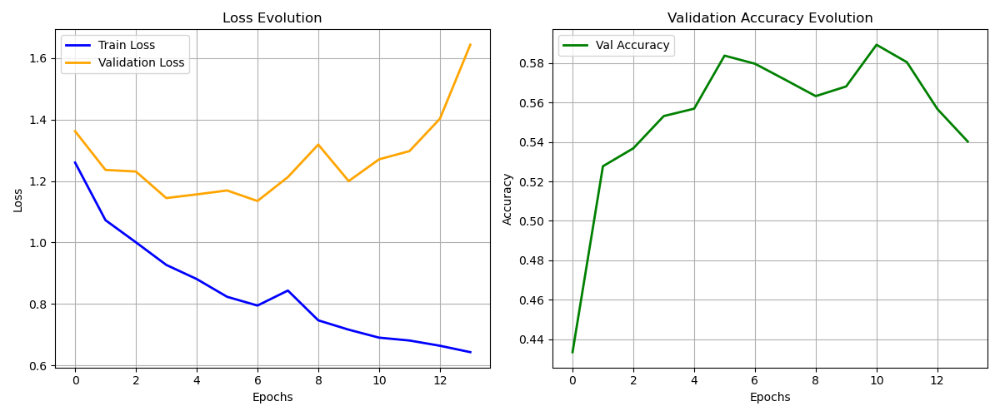
We now want to make the architecture more robust by adding some batch normalization between the layers (regularazing and reducing covariate shift maybe)
Using some type of pooling before the flattening of the maps, the idea is to change the convolution layer after the concatenation such that it has more filters so the flattening is more "clean" while reducing height / width.

- The Pooling layer we opted to use is the adaptive max pool since it is better than the average in the case of the spectogramm since it is more able to identify the peeks while the average risks to diluite the changements making them noisier, moreover the maxpooling offer a great invariance to translations making it suitable for our case where we slide the window between the different instances.

Moreover we change the loss function to make it less sure about its own decision such that it is more capable of generalizing and less prone to overfit
We also put some kind of L2 regularization by increasing the weight decay cause u never knoe maybe its a good idea
The last optimization in the trainig process was to make the learning rate adaptive in a temporal way such that it is faster at the beginning and then slower when it need to find the optimum. To do so we opted to use the Cosine Annealing.
We obtained the following results:
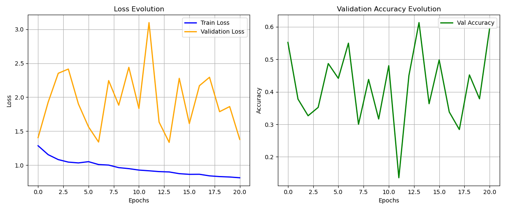
Which we can see tends to overfit in a reduced way but there is still a lot of noise in it, which we would like to remove

To do so we try to do two different things, change the pooling to not be adaptive but such that it just have a kernal size equal to 2 and stride = 2 so it reduce by 4 the dimension. Moreover we opted to use the InstanceNormalization instead of the BatchNormalization which basically normalize based on the value of the cells of the matrix instead of normalizing based on the value of the cells in different instances in the batch, which theoretically should make the model focus more on the content since each value in the matrix is normalized by the values in that matrix making matrices with different type of noises behave in the same way even if the user is positioned in different ways from the transmitter/receiver of signals.
We also opted in implementing gradient clipping since we saw that in case of strange batches of data we obtain way worst performances and make the model way worst with the risk of not coming back (collapse of the model).
With this new updates indeed we obtained a way better model that is less affected by noise and way more stable:
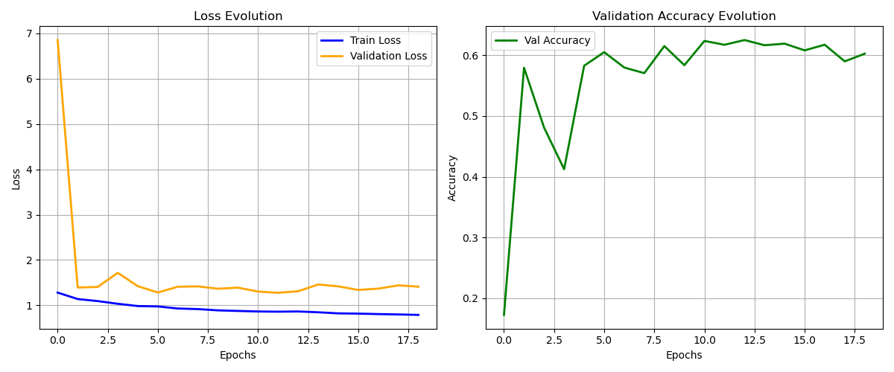

The last thing we tried to implement on the standard convolutional architecture was to increase the number of training data by exploiting data augmentation, indeed in the case of the spectrograms we have specific techniques like the masking block

- Time Masking -> set to zero values in a given row, the model has to understand the activity even in case of temporal holes in the signal
- Frequency Masking -> set to zero values in a given column, the model has to understand the activity even in case of a specific frequency that is affected by a total interference

We have also implemented the confusion matrix to have more information about what is happening in our training and which are the classes that we are better at identify and which are the ones we have more difficulties:

What we can notice is that some classes seems more difficult to predict than others:

- the network confuse L for E, meanwhile is very sure when it comes to predict E , seems like prediliges E between the two when it is undecided, probably given by the fact that the samples with E activities are more numerous than the ones with E, but still E has a decent amount of samples. If E represents the absence of movements, then L should be an activity with a very low energy and the network looking at the low energy in the doppler spectrogramm opts the safest way where there are more samples
- Jump Run and Walk are quite similiar to each other given the fact that they are big movements, especially jump have a low accuracy since it is often confused for walking
- H and C are quite interchangable since they are both the only other class that the model confuse the other with, so they could have a very similiar spectral firm
- S is confused for almost every class that requires a quite low amount of energy (so all other than jump, walk and run)

Our hypothesis is that the problem resides in the fact that the convolutional network is not able to classify correctly activities of similiar level of energy since they miss part of the temporal information and by the fact that movements at low energy levels could be confused by some background noise

So what we want to do now is to try to implement some kind of recurrency in the network such that we can extrapolate more information from each matrix.\
The idea is to put some kind of recurrent network after the inception layer, in this way we make the convolution filters extrapolate the useful patterns and then we pass those patterns in input to the recurrent layer that learn the evolution of the action in time such that we have more information to base our prediction on.\
Initially we implemented a bidirectional LSTM layer where we basically take in input the output of the convolutional network and indicate the temporal dimension as the one we want to use to extract the recurrence and unify the filter and frequencies dimensions as the other dimension that we want to extrapolate informations on. Indeed istead of flattening all dimensions together, we preserve the time dimension as a sequence.\
The bidirectional processing let the model leverage all the temporal context in both direction which is useful since we have the hole spectogramm to compute at the beginning and give us more informations. The output of the LSTM is averaged across the time dimension to obtain a single global representation to pass to the head projection used to merge the informations of the 2 directions together:
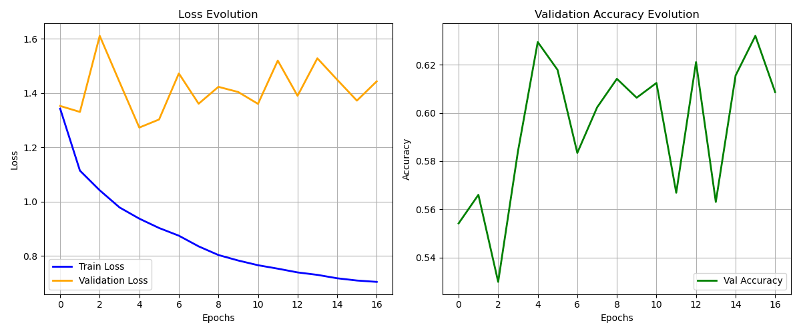
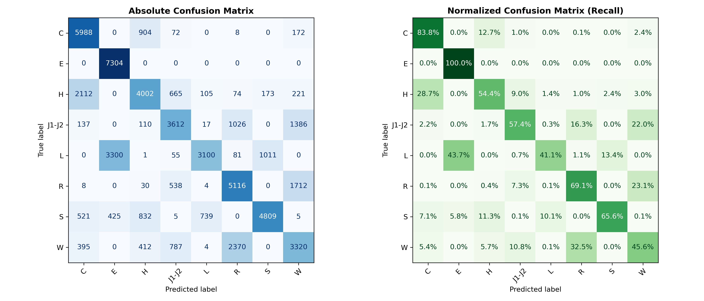

Looking at this model we can have mixed feelings, indeed we can notice that we obtain a significative improvement in the trainig indeed the model was increasingly improving in the training loss, the problem however resides in the validation loss, which suggests us that we are quite overfitting, so the next step is to try and reduce this problem as much as possible.
The first step we opted to adopt is to increase the stride of the sliding window in the training set, indeed using a recurrent network, having too similiar matrices can only make the model overfit on those that he sees more frequently. So we will use stride = 25 on the training while keeping the one of 5 for the validation / test since we want to have results that are less affected by randomness as possible
The second technique we decided to adopt is to make the output of the LSTM not only focus on the mean of the different instances of time, but also the max and variance, in this way we have a better understanding of the distribution which could help us to distinguish the cases like the ones between lie down and empty
we also tried to add minor regularization like increasing weight decay and dropout in the head projection.
This are the results:
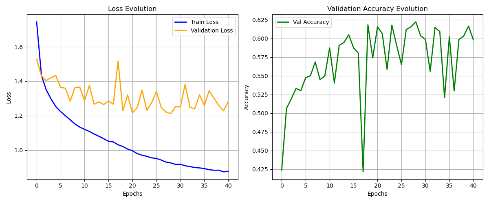
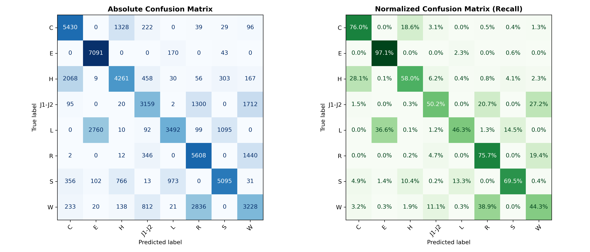
Which we can say that are great since we reduce the overfit given by the fact that the validation loss decrease for 50 epoches instead thatn after 5 ephochs it already start overfit too much which is a good result, moreover the model seems more stable and we can notice an improvement of the performances in those class we where more concerned of.

But still the results are quite poor so we opted to change the approach on how we read the data for the training and make the predictions. Indeed we have 4 different channels for each room/activity/day monitored, and until now we just took those 4 different instances as independent instances to train the model on, the problem on this are 2: no assumption of iid (which is also already affected by the sliding windows but in this case those are extactly the same movement monitored at the same time), and we dont leverage the fact that we have multiple information on a given instance, which is quite a pity. The idea is to now use the channel fusion and see if it actually fix our problems of accuracy. So what we basically do is to take a kind of majority vote between the different channels on the given action on the same given moment and take that as predicted label.\
To do so we have lowered the dimension of the batch otherwise the epochs would have a very low cardinality and implemented a new dataset that put in a list all the matrices that register the same thing but with different channels such that we have all of them in the same batch all the times, we have also increase the number of epochs of train since we have less instances in each epoch (indeed if before we have 4 times the instances, know we group those as one instance to make the prediction): LATE FUSION.

At first we thought that to optimize the trainig and validation, computing the loss directly on the mean of the logits was a better solution to obtain covnergence in the model, however the empirical comparison shows that the aggregated optimization brings a rapid overfit on the training campaign making the model reach a max accuracy of 75% with very high variability.
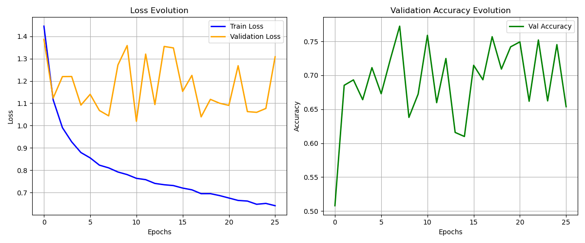
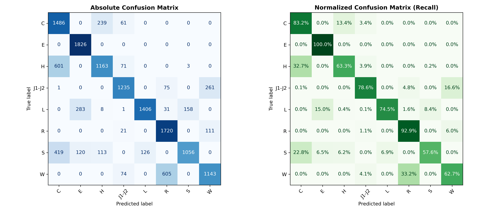
We can notice that the biggest problem of this model is the fact that it overfit a lot on the data, we would like to get a model that is more capable of generalizing data.

Instead making the training on the different channels and then take the aggregation of them in the validation works pretty well as regolarization parameter since it makes the network extract the significant features in an independent fashion between channels decreasing the co-adaptation that makes the networrk generalize way better in the domai shift with an accuracy of 85% and more stability.

The following are the results of the obtained model:
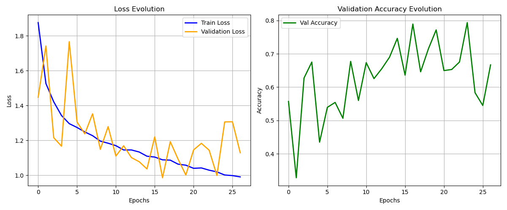
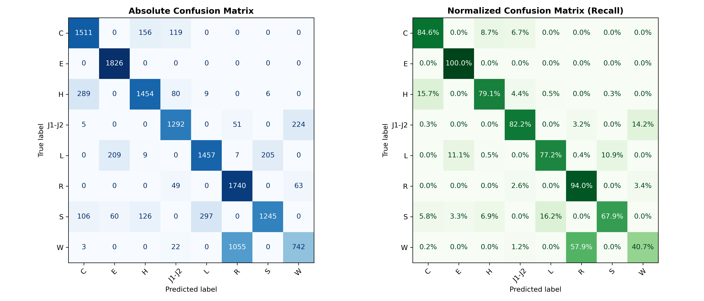
We can notice that with this correction the model performs way better than before, the problems given by the lie down activity and the jump activity are way less and we have a more precise model that doesn't overfit at all since the validation loss is a random walk around the training loss, maybe one thing we could improve is to reduce the variability, but since now we have moved to a lower number of batches due to the fact that we need 4 instances to classify a given moment it is quite normal.

Another thing we wanted to try is to now remove the instance normalization since it kind of make the filters treat in the same way matrices with different energies since we normalize the matrix and maybe now that we have implemented recurrency if elements are more distinct it could actually benefit the model
To solve this without regressing on training stability, we transitioned from Instance Normalization to Global Z-Score / BatchNorm, preserving cross-sample energy relationships. The following are the results of this refinement:
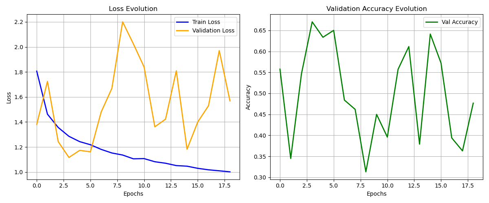
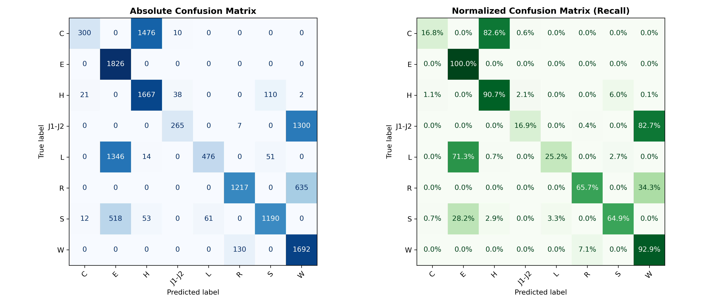
We can notice that this attempted improvement works way worst than the previous architecture indeed now the model is not able to classify jump and lie down, morever now it exchange C as H. This could be due to the initial intuition that batch norm tends to offuscate the data in a way that is bad for spectrograms since it just create noise in the background given by other batches so we will stay with our instance normalization.

To investigate the role of signal energy in activity classification, we conducted an ablation experiment comparing two normalization strategies on the multi-channel Late Fusion architecture:

- Instance Normalization (per-window contrast scaling)
- Global Z-Score Standardization (computed on the training set) combined with Batch Normalization

The experimental comparison yielded a clear result:

- Instance Normalization achieved superior performance, reaching ~80% validation accuracy with stable validation loss curves. It effectively isolated micro-Doppler frequency shifts, enabling the model to correctly identify *Jump* ($71.3\%$) and *Lie down* ($80.6\%$).
- Global Z-Score + BatchNorm caused a severe model collapse. As shown in the validation curves, the validation loss exploded past $2.5$, with accuracy dropping to $33\%$. Crucially, the confusion matrix reveals that without per-sample gain normalization, $82.7\%$ of *Jump* instances were misclassified as *Walk*, and $71.3\%$ of *Lie down* instances collapsed into the *Empty* class.

In Wi-Fi CFR/Doppler spectrograms, absolute signal amplitude is heavily corrupted by path loss, distance to antennas, and hardware Automatic Gain Control (AGC). A global Z-score leaves these position-dependent gain variations intact, forcing the model to classify based on signal power rather than movement patterns.

Conversely, Instance Normalization acts as a local contrast enhancement, making the representation invariant to subject distance while preserving the structural micro-Doppler velocity signature. Consequently, Late Fusion with Instance Normalization was selected as our final optimal architecture.

To check if all the updates we made on the architecture where actually helpful or its just the channel fusion to make the magic, to do so we implemented it in the baseline architecture using the training parameter we used in the current model and obtain the following results:
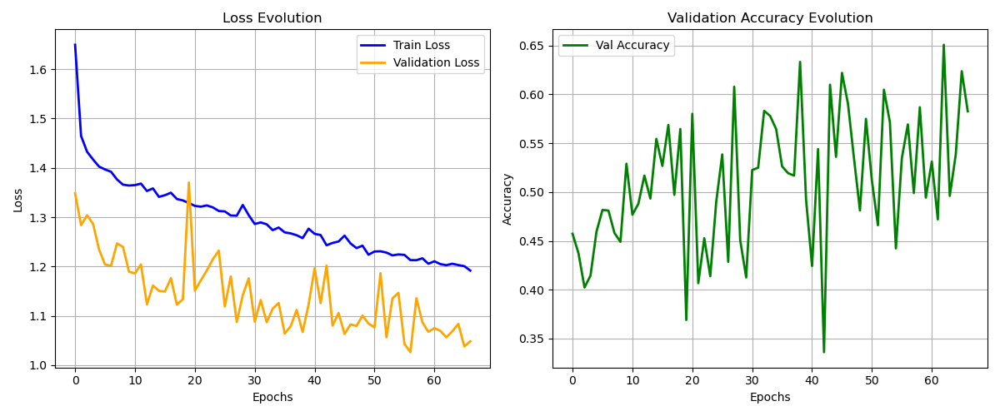
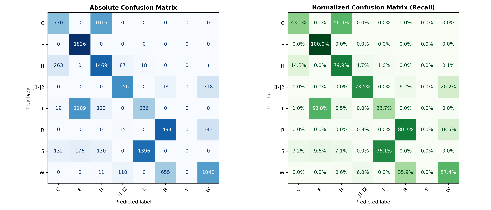

We would now to implement a new technique on how to deal with the results of LSTM and aggregate the temporal informations:
Instead of relying on global statistics, we implement a temporal attention mechanism to identify the features we are more interested in for a given case and which are less interesting, which should make us increase the performance theoretically. especially in the case of the jump / walk and the lay / empty activities, that are the one our current model makes more difficulties to learn.
To do so we designed a temporal attention layer that computes the relevance score for each temporal frame through a ff layer that is then passed to a softmax function to normalize the values. The final vector is constructed as the weighted linear combination of the frame-level lstm representations
We opted to keed the standard deviation with the attention to get additional information on the type of movement (continued or instantaneous).
While the BiLSTM captures the sequential dependency and temporal context across adjacent frames, the Temporal Attention layer acts as an adaptive pooling mechanism. It replaces static global operations (like time-averaging) by dynamically selecting and emphasizing the most informative LSTM hidden states while suppressing stationary background frames.
The results are the following:
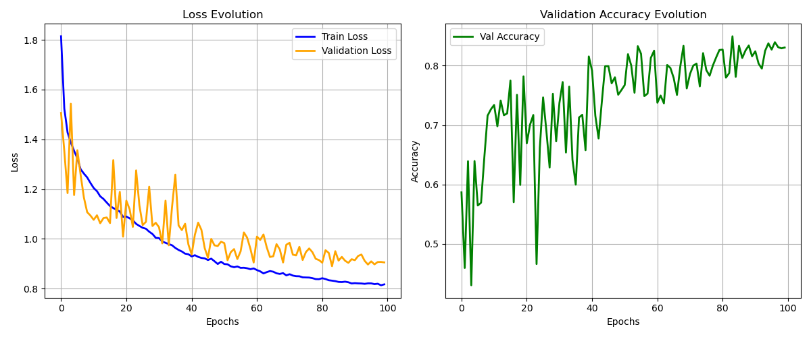
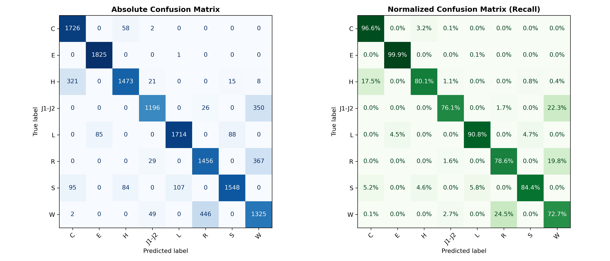
Accuracy : 83.48%
Macro F1-Score  : 83.52%

In alternative to this we tried to subsitute the LSTM with the attention with a multihead transformer encoder, giving us very bad results, probably due to the fact that the transformer is better in obtaining the context in case of longer sequence and is more prone to overfit in case of less samples.
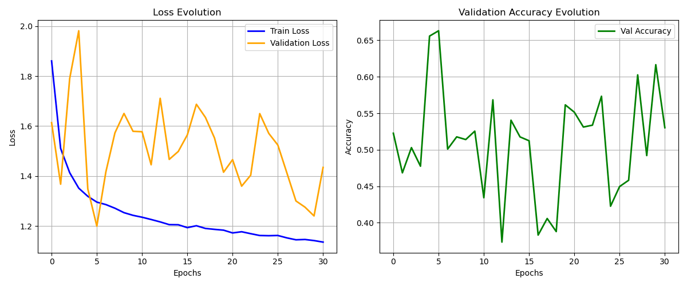
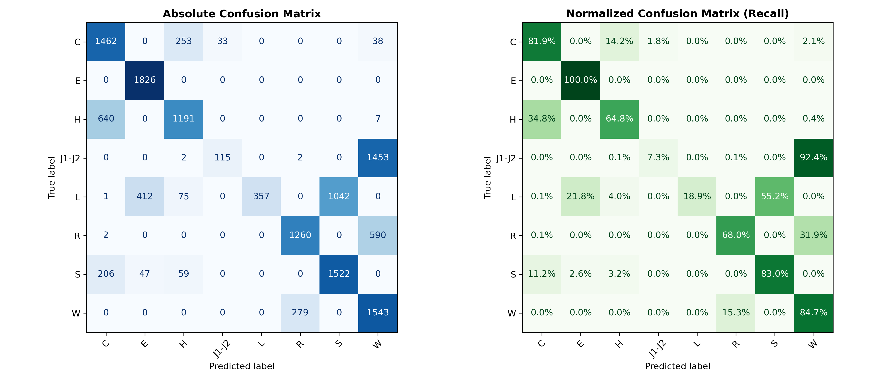
Indeed we can notice that it is very sure about some classes, making it too confident and making wrong decisions

Which we can notice improve a lot the model making it perform way better than before. The biggest problem we can notice on tihs model is that it still make difficulties in classify the high energy movements correctly, indeed it seems to confuse them quite oftenly.
One first improvement we implemented for this purpose is to try choosing the final label in a better way, indeed there could be a channel that is more confident about its decision than the other 3, so we should rely more on him than on the others, to do so we implemented a softmax entropy weighting.\
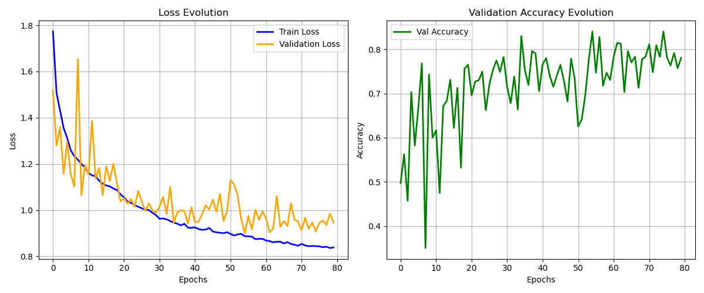
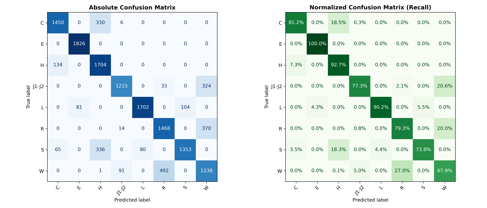
we can notice that we have less difficulties in distinguish H from C but now we have more difficulties in distinguish C from H and the other results are kind of the same but a little worst, so we can say that just taking the mean of the 4 antennas instead of the weighted average is better since it is less penalized in case the antenna that is sure has made a wrong decision

a second improvement we implemented is specific to try improve the classification in case of jump/walk/run, which is to also obtain from the input the derivative from subsequent frame, in this way we can catch the acceleration of changements in a fixed way.
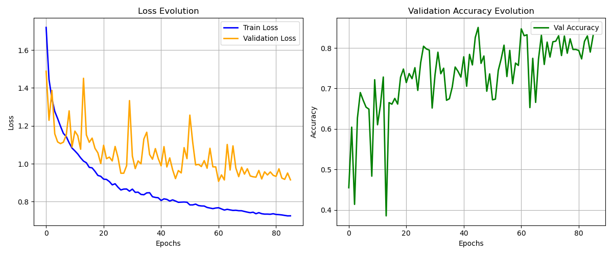
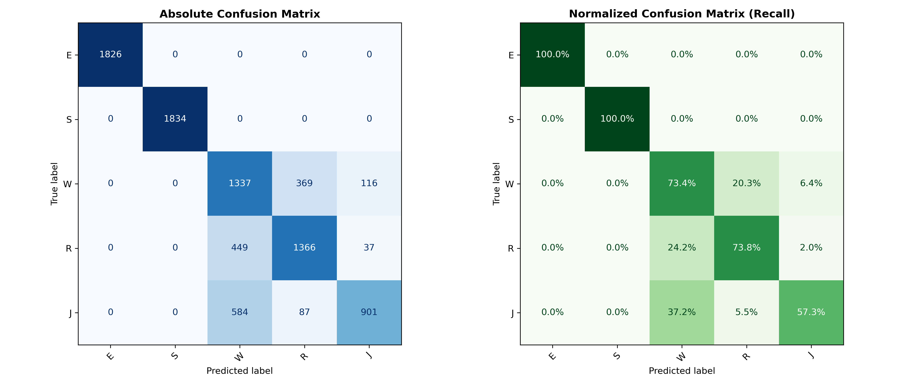
Accuracy : 84.24%
Macro F1-Score  : 84.05%
which has some improvement in the classification of J but is a little worst in classifying S

we want now to test the model just on the main challenges which are jump, run, walk, sit and empty using other environments as test set to check if we are able to generalize also in the case of another environment. In the validation set we still just use the dataset S1 since its the one we have to use for the training, so what we are trying to do now is to make the model focus on the activities more interesting for the paper and see if in this case the model performs better or there is still the problem of jump, run and walk.
and we saw that the model is already quite good at generalizing to other environments / persons giving an accuracy / f1-score pretty similiar to the one obtained on the same environment.

But we saw that the problem is always the same -> the architecture have some difficulties in distinguish jump, walk and run, this could be due to the fact that with a window of 2 seconds, the model have some difficulties to distinguish an exèosive action like a jump from a more constant activity.
To try deal more properly with this issue we tried to fix the loss function such that it penalizes the more difficult instances more than the easier ones, which is using a Focal Loss together with the multi-class cross entropy loss.
We also implemented some update in the architecture to make it smoother, precisely we tried to make the inception module more robust and increase the parameters in the lstm module, moreover we retried to implement the different models that takes the decision in different ways:

- standard method where we use the individual instances in the training and then do an ensamble in the validation
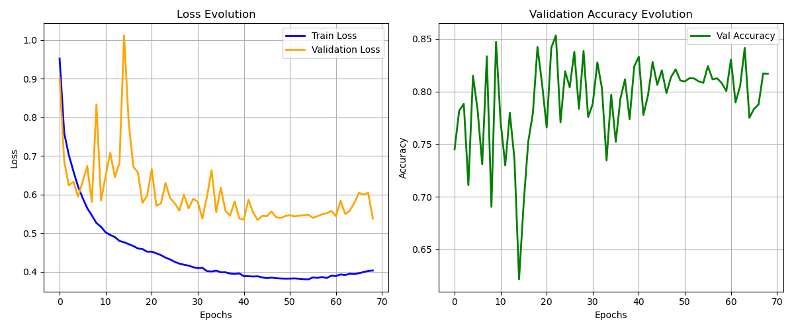
- alternative method that implemets the sofmax entropy weighting both on training and validation -> it also has a temperature parameter that makes it choose the way the decision is influenced by the most confident antenna.
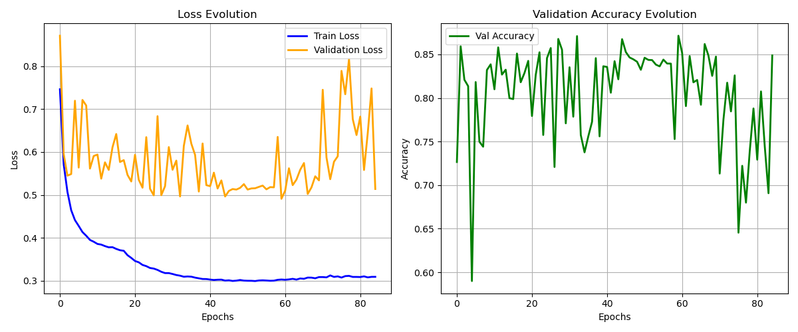
- alternative method that implements attention between the channels both on training and validation
while the other model we tried to make the inception module more robust and increase the parameters in the lstm module, moreover we retried to implement the model that takes the mean even in the train.
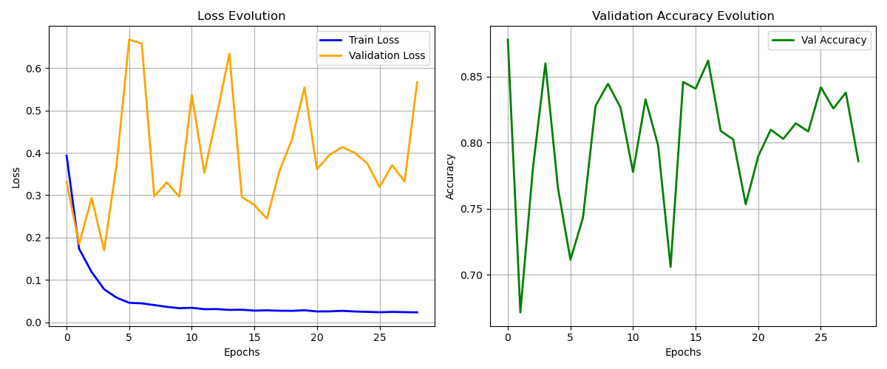

From the results we can notice that the model using sofmax entropy weighting is the best since it's validation loss is more stable and has more prospect to be improved, given this we tried to focus on this technique and try to improve it by balancing the weight of the different classes independently by the number of samples, in this way a class will not be preferred in case of more instances, we also tried to use a different scheduler using the ReduceLROnPlateau and switched to AdamW which are theoretically provides more stability, the goal here is to make the training more responsive and less variable.
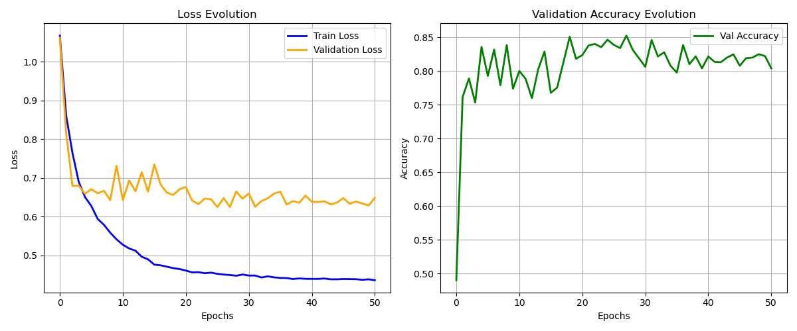
The new model seems to be more robust with a less variable loss meaning that the model is learning in a more stable way, moreover from the confusion matrices given by the different dataset we can notice that this new model is more able to evaluate evenly the different activities while the previous model was more confident about some classes and less confident about some others. But still the gap between training loss and validation loss is pretty high and we want to make it generalize better to the situations where the model see different days/environment/persons.
To do so we tried to increase the regolarization by increasing weight decay and dropout and by slightly reducing ability of the classifier and by implementing mixstyle at the end of the inception module such that we simulate different environments.
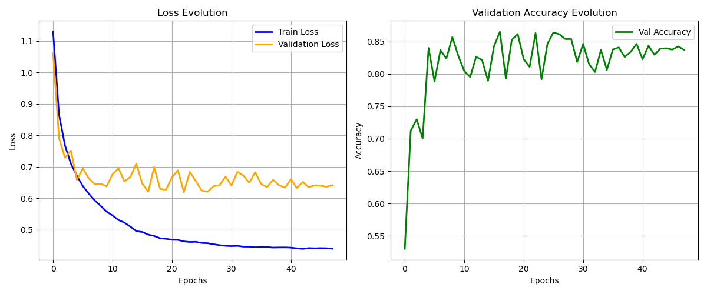
this are the obtained results it seems like the regularization has bring some benefits but still not enough probably, moreover the regularization made the model predict the classes more evenly without biasing too much on a specific class.

We have also tried to increase the regularization by making the spectogram augmentation implement some kind of noise in the data, but in this way we receive a slighty more regularized model that is less stable and with slighty worst performances indeed it is maybe too conservative so we stick with the model obtained at the previous point.

### Contrastive learning integration

To further improve generalization and reduce overfitting to environment-specific patterns, we explored the use of contrastive learning as an auxiliary training signal in the attention-based models. The idea was not to replace the classification objective, but to encourage the network to learn embeddings that are more structured and less sensitive to the specific room, antenna position, or acquisition conditions. For this reason, we modified the architecture by adding a projection head on top of the shared representation obtained from the four antenna views. During training, each sample produced a projected embedding for each view, and a Supervised Contrastive Loss was computed on these embeddings so that samples belonging to the same class were pulled together while samples from different classes were pushed apart.

Compared to the previous versions, the main changes were the following:

- we kept the standard classification loss as the primary objective, but combined it with the contrastive loss in a weighted sum of the form $L = L_{CE} + \lambda L_{contrastive}$;
- we introduced a warm-up schedule for the contrastive weight, so that the auxiliary loss became active gradually and did not destabilize the beginning of training;
- we used a projection head separate from the classifier head, allowing the model to learn a representation optimized both for discrimination and for class-structure preservation;
- we adapted the training pipeline so that the four antenna-view predictions were fused in a principled way before computing the classification loss, preserving a consistent supervision signal for the final decision, obtaining the following results respectively on different days, different environments and different persons:
Model Evaluation Results:
Accuracy : 83.52%
Macro F1-Score  : 83.23%
Model Evaluation Results:
Accuracy : 85.90%
Macro F1-Score  : 85.78%
Model Evaluation Results:
Accuracy : 86.79%
Macro F1-Score  : 86.61%
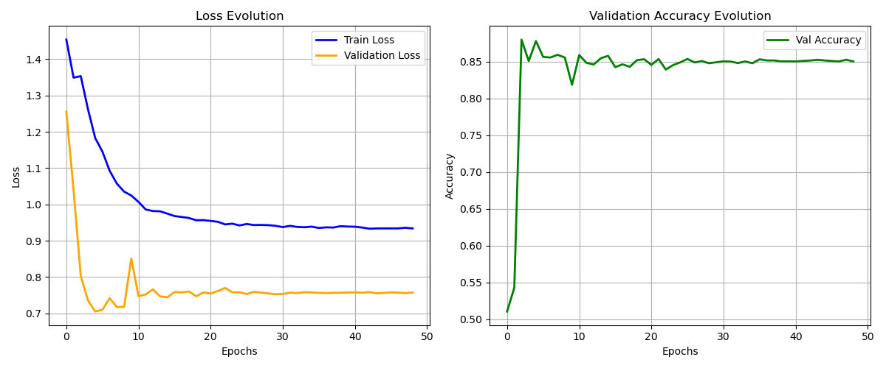
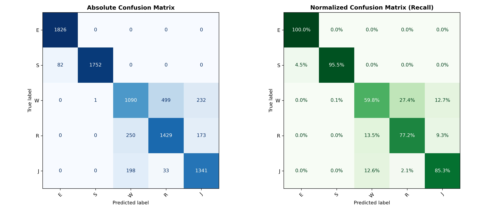
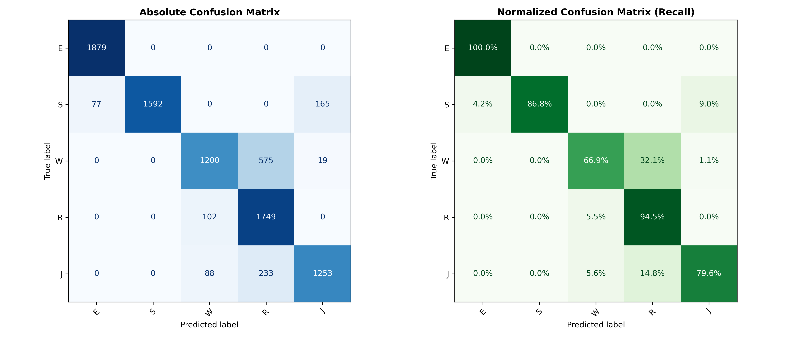
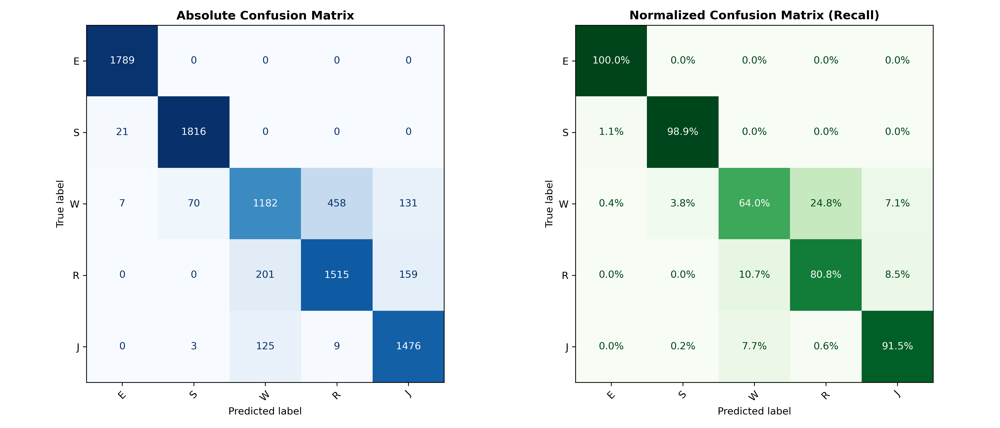

- we also kept class-weighted cross-entropy and stronger regularization to mitigate the imbalance between classes and reduce overfitting:
Model Evaluation Results:
Accuracy : 82.62%
Macro F1-Score  : 82.10%
Model Evaluation Results:
Accuracy : 83.68%
Macro F1-Score  : 83.11%
Model Evaluation Results:
Accuracy : 81.89%
Macro F1-Score  : 82.24%
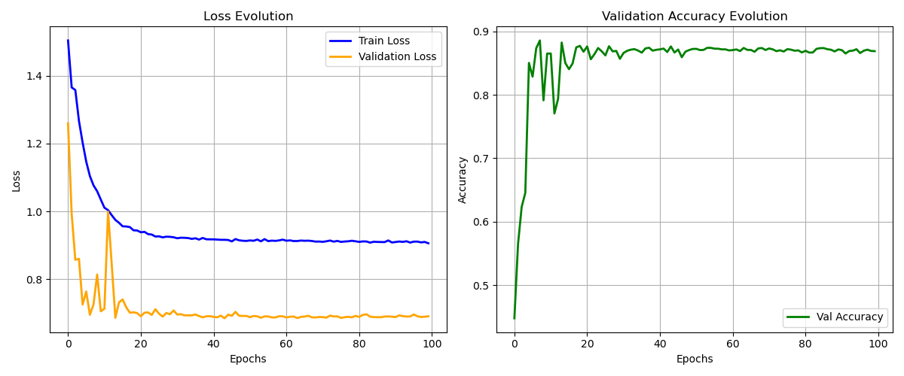
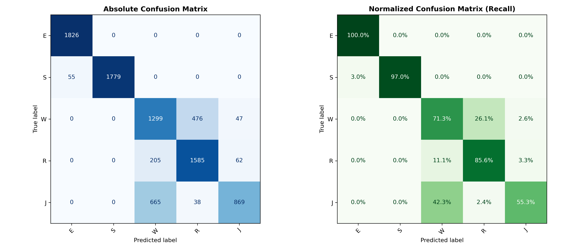
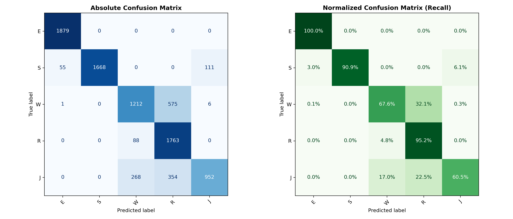
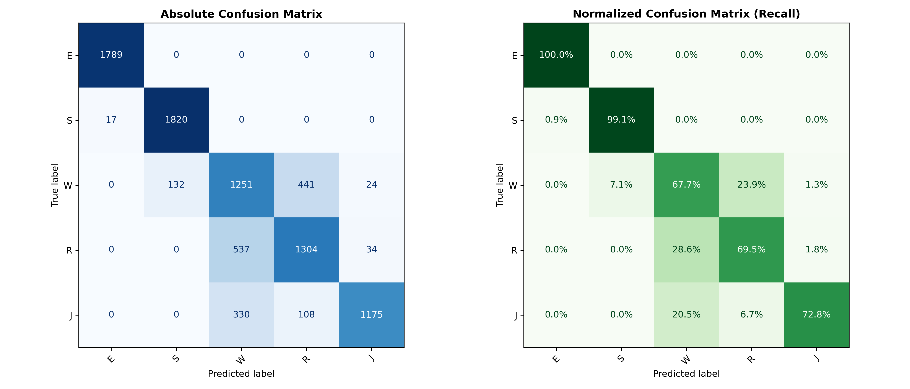

- we also tried to use attention in the choice of the more reliable antenna for the decisions
Model Evaluation Results:
Accuracy : 80.11%
Macro F1-Score  : 79.82%
Model Evaluation Results:
Accuracy : 86.79%
Macro F1-Score  : 86.44%
Model Evaluation Results:
Accuracy : 83.64%
Macro F1-Score  : 83.95%
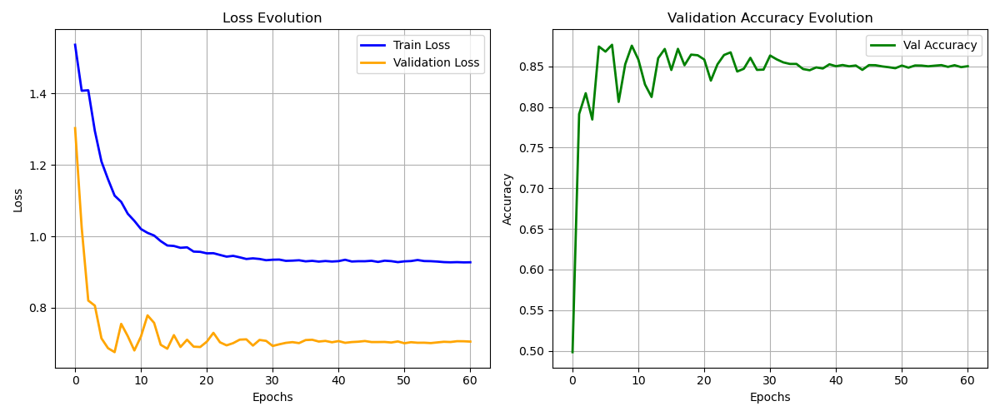
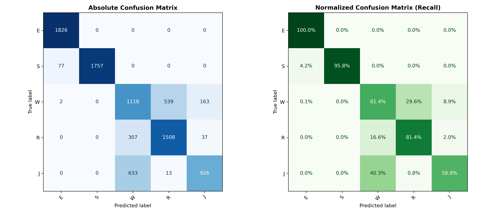
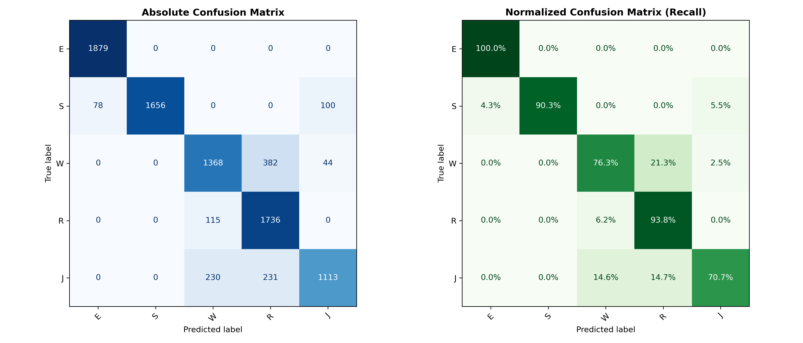
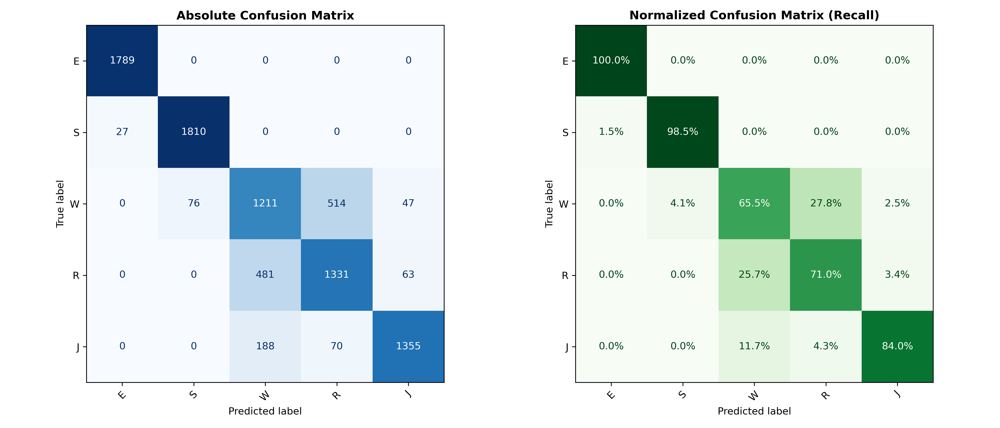

The goal of this change was to make the learned representation more robust to domain shifts, especially in cases where the same activity is observed under different conditions. In practice, this added a regularization effect that helped the model focus on activity-relevant features rather than purely on spurious environmental cues.

## Person Identification task

We want to develop a domain-invariant pipeline robust to subject recognition

---

### 1. Architectural Pipeline & Contrastive Integration

The classification pipeline merges a customized multi-antenna feature extractor with a Supervised Contrastive Learning (SupCon) framework to enforce spatial and environmental invariance.

- **4-Channel Inception Backbone:** A dedicated convolutional backbone (`BaselineNet`) was developed using a modified `InceptionModule` structured to process **4 synchronized Wi-Fi receiving antennas**  simultaneously. The block concatenates multiscale convolutions yielding a 52-channel feature representation. To preserve temporal resolution across the Doppler spectrograms, a $1\times1$ convolution (`out_channels=16`) was applied prior to flattening, feeding into a high-capacity 256-unit dense layer regularized by `Dropout(0.4)`.
- **Supervised Contrastive Module Integration:** To prevent the network from overfitting to static architectural features (e.g., room walls and furniture reflections), a standalone Supervised Contrastive Loss module  was grafted into the classification architecture. To decouple feature representation learning from standard linear inference, a 3-layer **Projector Head** ($256 \to 128 \to 64$) was appended directly to the 256-unit latent embedding.

### 2. Evaluation Protocol & Data Split Strategy

To eliminate data leakage and evaluate true domain generalization, the dataset was partitioned into three distinct experimental benchmarks based on physical room geometry and propagation conditions:

| Subject | Training Environments | Testing Environments | Benchmark Objective |
| :--- | :--- | :--- | :--- |
| **Persona 0** | `S1a`, `S4a`  | `S2a`, `S6a`, `S4b` | **True Zero-Shot:** Tested in 100% unseen rooms & different hardware. |
| **Persona 1** | `S3a`, `S5a`  | `S3a`, `S5a` (Last 15% time slice) | **Multi-Domain Robustness:** Solved the No-LOS propagation collapse. |
| **Persona 2** | `S7a` (First 70% time slice) | `S7a` (Last 15% time slice) | **In-Domain Control:** Anchor to verify baseline stability. |

- **Solving the Non-Line-of-Sight (No-LOS) Collapse:** Early zero-shot evaluations revealed a critical physical limitation: models trained solely on a clean Line-of-Sight room (`S3a` for P1) suffered severe performance degradation when evaluated on a No-LOS room (`S5a`), misclassifying P1 as P0 in over 80% of cases due to direct-path signal attenuation. Incorporating `S5a` into the training set restored P1 classification accuracy to **~96–98%**, confirming that the Contrastive Loss successfully builds an invariant biometric cluster when exposed to sufficient spatial diversity.
- **The Zero-Shot Benchmark (Persona 0):** P0 is evaluated exclusively on rooms (`S2a`, `S6a`) where the model has never entered. Residual misclassifications (P0 predicted as P1) are physically expected under severe RF Multipath Domain Shift, as unknown acoustic reflections distort P0's profile, occasionally mimicking the No-LOS signature learned for P1.

---

### 4. Optimization Debugging: Confidence Overestimation & Early Stopping

Monitoring validation convergence revealed a critical divergence between logarithmic loss and discrete classification metrics:

- **Loss vs. Accuracy Divergence:** Experimental logs showed that Validation Cross-Entropy Loss reached its minimum (~0.46) around Epoch 3 before steadily ascending, whereas Validation Accuracy continued to climb stably up to **~89%** by Epoch 15.
- **Diagnosis:** This behavior was diagnosed as *Confidence Overestimation*. In a 3-class classification problem, once the network becomes highly confident, a single misclassified window predicted with 99% confidence penalizes the logarithmic loss severely ($-\log(0.01) \approx 4.6$). While the aggregate loss appeared degraded due to a few high-confidence outliers, the underlying feature representations and classification accuracy were still maturing.
- **Metric-Driven Model Selection:** Because Cross-Entropy acts strictly as a *surrogate loss* for gradient backpropagation, relying on minimum Validation Loss for Early Stopping prematurely aborted training during the network's underfitting phase. The training loop was modified to checkpoint models (`best_model.pt`) based on the **Validation Macro F1-Score**. This ensures the selection of weights with the highest real-world generalization and class balance across all subjects.
- **Label Smoothing Calibration:** label smoothing ( was removed from the primary loss function to prevent artificial class uncertainty from smearing decision boundaries in latent space during unseen room evaluation.

---

### 5. Summary of Results of last test

- **~100% In-Domain Accuracy** on control baseline (P2).
- **~95% Multi-Domain Accuracy** under No-LOS conditions (P1).
- **~74% Zero-Shot Cross-Environment Accuracy** in completely unseen rooms (P0).

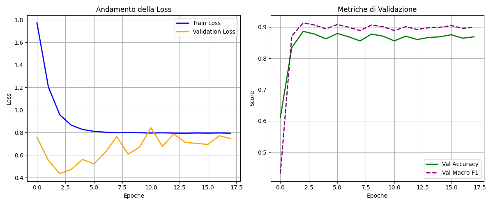
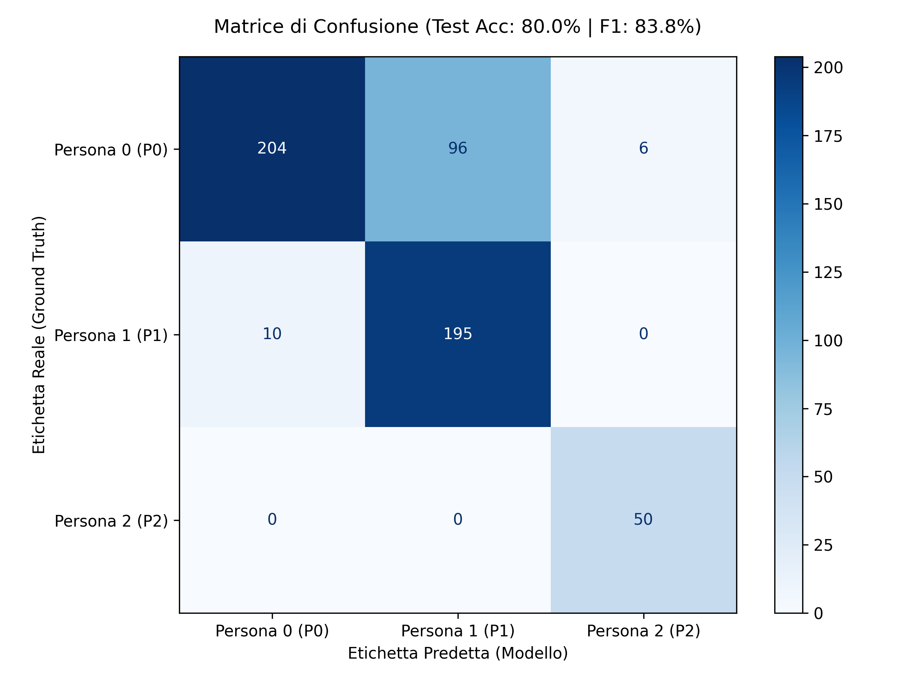

### 6. Architectural Experiment: Why We Reverted from LSTM/Attention to Pure CNN

To see if tracking temporal sequences could improve our Person Identification (PI) results, we borrowed the recurrent module (`LSTM + Self-Attention`) developed by our HAR team and grafted it onto our 4-channel Inception backbone.

adding the recurrent layers caused a massive performance drop on our Zero-Shot benchmark. Instead of generalizing better, the model started overfitting heavily and failing on unseen rooms.

In Activity Recognition (HAR), time matters—an action evolves sequentially But Human Identity is all about instantaneous micro-Doppler frequency bursts caused by how hard someone's heel strikes the floor or how their limbs swing. Running these quick frequency spikes through a bidirectional LSTM and attention pooling effectively "smoothed them out," washing away the exact biometric details we needed.

We reverted to our **Pure Convolutional Backbone (`Inception + SupCon Projector Head`)**.

### Evaluation of Ensemble Strategies and Final Selection

Although the Weighted Ensemble achieved an **89% Macro F1-Score**, The ensemble approach was discarded for the final configuration.

#### Technical Rationale and Advantages:
1. **High Predictive Correlation:** The models share the same architecture and fail on the exact same physical distortions (*extreme Multipath in Zero-Shot environments*). The ensemble does not correct error residuals, merely averaging confidence.
2. **Computational Efficiency and Latency:** Using a single model eliminates memory overhead and drastically reduces inference time, which is essential for deployment on *Edge* devices (e.g., Wi-Fi routers).

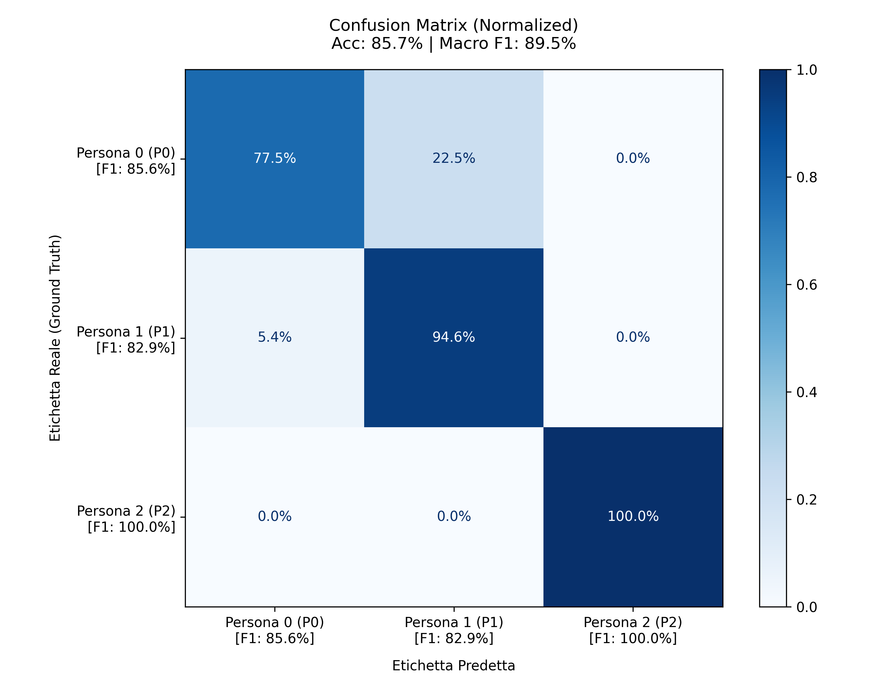

# Contrastive Learning Report

This document summarizes the contrastive-learning experiment we ran on top of the Wi-Fi Doppler activity classifier, the results we observed, and the most reasonable next directions.

### What We Tried

We started from the convolutional baseline and added a supervised contrastive learning objective in order to make the latent space more discriminative. The encoder was kept the same, while a projection head was added only for the contrastive branch.

At first, we used augmented versions of the same spectrogram window as positive pairs, following the same masking strategy already used in the baseline. The goal was to make the model learn invariances while still predicting the activity label with cross-entropy.

Later, after noticing that the masking was probably too aggressive, we switched to a cleaner formulation where the four antenna recordings of the same event were used as aligned positive views. This was a more meaningful source of positives because the antennas observe the same action from slightly different perspectives.

The final training objective was a weighted sum of:

- label-smoothed cross-entropy for classification;
- supervised contrastive loss for representation learning.

We also introduced a warm-up for the contrastive term so that the classification part could stabilize first.

### What The Training Showed

The training curves were initially encouraging. During the best run, the model reached roughly 0.72 validation accuracy at its peak, while the validation loss dropped to around 1.0 at best. This looked promising at first glance, because it suggested that the encoder was learning something useful and that the contrastive branch was not completely destabilizing training.

However, after looking at the evaluation more carefully, the result was not as strong as the raw accuracy number suggested.

The final evaluation of the second contrastive model gave:

- Accuracy: 58.96%
- Macro F1-score: 57.25%

The best validation loss during training was about 1.25, and the best validation accuracy was around 61.2%, but the confusion matrix showed that the model was still mixing several difficult classes. In other words, the model was not truly separating the activities well; it was often getting the right global score while still confusing the important classes.

### What Did Not Work Well

The first issue was the masking. Strong time and frequency masking made the task harder than it should have been, especially when the same masked views were also used for the contrastive branch. In practice, this likely destroyed some of the spectral structure that the model needed to preserve.

The second issue was that the contrastive objective was too difficult too early in training. The training loss remained noticeably higher than the validation loss, which is not automatically a bug in this setting, but it does indicate that the model was seeing a harder optimization problem during training than during evaluation.

The third issue was that the confusion matrix did not match the improvement suggested by the accuracy curve. The model still confused the more similar activities and the lower-energy classes, which means the representation was not yet robust enough for fine-grained recognition.

So although the aggregate numbers were not terrible, the model was still underperforming in the sense that it did not produce a clean class separation.

### Best Conclusions So Far

The most important conclusion is that contrastive learning does help to structure the embedding space, but only if the positive pairs are meaningful.

The four antennas are a better source of positives than synthetic masking alone, because they correspond to the same real event and therefore preserve the underlying activity label more faithfully.

Another conclusion is that the model likely benefits more from stable, semantically valid views than from heavy augmentation. For this dataset, too much masking seems to remove signal instead of removing nuisance.

Finally, the contrastive branch should probably be treated as a regularizer or a pretraining signal, not as the sole thing driving the whole training process from the first epoch.

### Brainstorming: What Should We Try Next?

The next iteration should focus on making the positive pairs cleaner and the optimization less noisy. The most sensible directions are:

- pretrain the encoder with supervised contrastive learning on the four antenna views, then fine-tune with cross-entropy only;
- reduce masking even further, or remove it entirely from the contrastive branch;
- keep the clean spectrogram for classification and use the antenna views only for the contrastive objective;
- test a stronger multi-view fusion strategy, instead of just averaging the logits across antennas;
- move the contrastive experiment onto the stronger recurrent or late-fusion backbone, since temporal modeling already helped in the non-contrastive experiments;
- build more balanced batches so that supervised contrastive loss sees enough same-class positives in each batch;
- tune the contrastive temperature and projection head size only after the view strategy is stable.

### Short Summary

The contrastive experiment was not a failure, but it was also not the final answer. It improved the representation somewhat, and the antenna-based positive pairs are a better idea than masking alone, but the confusion matrix shows that the model still lacks the class separation we need. The next step should therefore be to simplify the augmentation, use the antennas more carefully, and probably combine contrastive learning with a stronger temporal backbone.

### Pretraining Version: What We Tried

In the second contrastive version, we changed the training scheme from a single mixed objective to a two-stage pipeline. First, we pre-trained the encoder with supervised contrastive learning on the four antenna views of the same event. In this stage, the backbone and projection head were optimized to bring embeddings of the same activity closer together, while the classifier was kept out of the objective.

After that, we fine-tuned the model with cross-entropy only. The idea was to let the encoder learn a better activity representation first, and then let the classifier specialize on top of those features. This was meant to reduce the instability we saw when the contrastive and classification losses were optimized together from the beginning.

### Pretraining Version: What The History Shows

The pretraining loss decreased slowly but did not show a strong separation between train and validation behavior. In fact, the validation contrastive loss stayed high and noisy across epochs, which suggests that the encoder was learning useful structure only partially. The best encoder checkpoint was saved early, but the later pretraining epochs did not visibly improve the situation.

The fine-tuning stage was more interesting. The model reached peaks around 0.72 to 0.75 validation accuracy and even hit a best value close to 0.76 at one point, which is better than the earlier contrastive version. At the same time, the validation loss remained unstable, and the model repeatedly moved between better and worse epochs. The early stopping at the end also confirms that the training was not converging in a clean way.

### Conclusions From The Pretraining Run

The main conclusion is that pretraining the encoder was the right idea, but it was not enough by itself to solve the classification problem. The staged setup was more sensible than mixing everything from the first epoch, because it gave the model a clearer optimization path. Even so, the final behavior still shows that the representation is not fully robust for all classes.

More specifically, the experiment suggests that:

- the four antenna views are still a better positive signal than masking;
- the encoder benefits from contrastive pretraining, but the gain is limited if the backbone is not strong enough;
- fine-tuning improves the validation accuracy, but the confusion matrix likely remains the real bottleneck;
- the training is still noisy enough that a stronger backbone or a better multi-view fusion strategy may be needed next.

So the pretraining version is a useful step forward, but not the final solution. It confirms that staged training is preferable, while also showing that the model architecture itself still needs improvement if we want cleaner class separation.

### Reduced Label Set: New Findings

After reducing the classification problem to 5 labels, the contrastive experiments improved significantly. The task became easier to optimize, the validation loss dropped much more cleanly, and the overall accuracy increased noticeably compared with the earlier multi-class setting. In practice, this meant that the representation learned by the encoder became more aligned with the smaller label space, and the contrastive pretraining strategy started to show its real benefit.

We retrained both the regular contrastive model and the pretraining-based contrastive model after this label reduction. The versions saved as the contrastive_3 runs and the contrastive_pretrained_2 runs both reflected the same general pattern: better global metrics, better stability during training, and clearer separation for most classes.

The one persistent weakness was the J activity. Even after the label reduction, the model still struggled to classify that class correctly. This suggests that J is either too heterogeneous, too close to one of the other remaining activities in the Doppler space, or simply underrepresented compared with the rest of the data. In other words, the label simplification helped the model a lot, but J remained the hardest case and kept limiting the final confusion matrix.

### Conclusions From The 5-Label Setup

The main conclusion is that label design matters as much as architecture. Once the number of classes was reduced, the same contrastive pipeline became much more effective, which means that part of the earlier difficulty was coming from the label space itself rather than from the model alone.

This also suggests that the contrastive approach is a good fit for the 5-label version of the task, because it can now focus on separating a smaller set of more meaningful activity groups. The encoder pretraining remains useful here, and the fine-tuning stage becomes easier to optimize when the class structure is cleaner.

At the same time, the remaining J confusion shows that there is still one weak point in the dataset/model pairing. The next step should therefore be to inspect that class more closely, either by looking at its confusion pattern against the other labels or by checking whether it needs a dedicated modeling strategy.

So, overall, the 5-label setup is a strong improvement and confirms that the contrastive pipeline was on the right track. The reduced label space made the task more learnable, and both retrained contrastive variants benefited from that change, but the J class is still the main obstacle to full performance.

